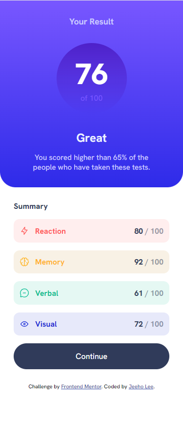
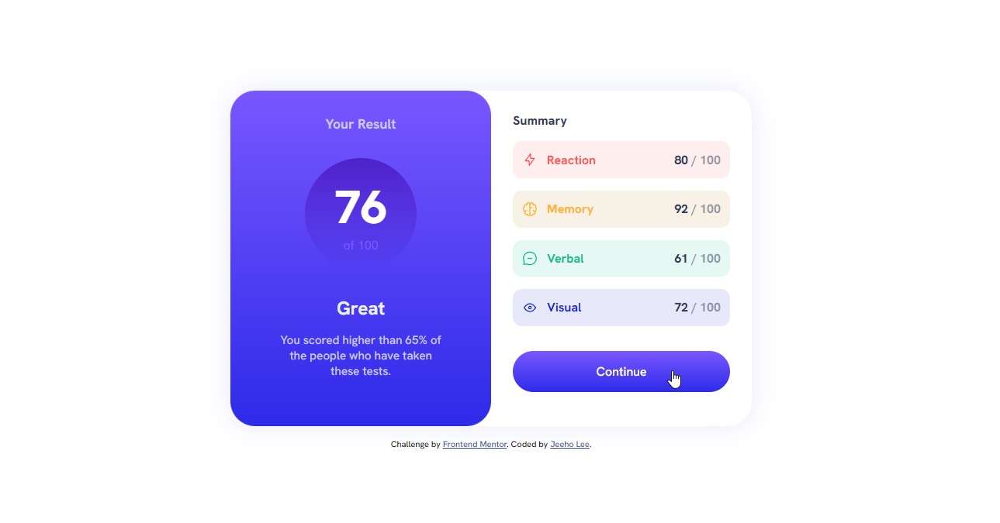

# Frontend Mentor - Results summary component solution

This is a solution to the [Results summary component challenge on Frontend Mentor](https://www.frontendmentor.io/challenges/results-summary-component-CE_K6s0maV). Frontend Mentor challenges help you improve your coding skills by building realistic projects. 

## Table of contents

- [Overview](#overview)
  - [The challenge](#the-challenge)
  - [Screenshot](#screenshot)
  - [Links](#links)
- [My process](#my-process)
  - [Built with](#built-with)
  - [What I learned](#what-i-learned)
  - [Continued development](#continued-development)
- [Author](#author)

## Overview

### The challenge

Users should be able to:

- View the optimal layout for the interface depending on their device's screen size
- See hover and focus states for all interactive elements on the page
- Use the local JSON data to dynamically populate the content

### Screenshot

### Links

- Solution URL: [https://github.com/jeeheezy/FEM-Results-Summary-Component](https://github.com/jeeheezy/FEM-Results-Summary-Component)
- Live Site URL: [https://jeeheezy.github.io/FEM-Results-Summary-Component/](https://jeeheezy.github.io/FEM-Results-Summary-Component/)

## My process

### Built with

- Semantic HTML5 markup
- CSS custom properties
- Flexbox
- Mobile-first workflow
- Javascript

### What I learned

This activity was a good refresher on how to fetch data from a json file and using a callback function to make use of the fetched data. At first I had tried to use the data from json without a callback function and was running into "Uncaught TypeError: Cannot read properties of undefined" because the Fetch API was asynchronously loading data. Using a callback function ensured any actions would be executed after a successful fetch. 

It was also interesting to note that the reference to external JS file in my HTML was sometimes acting out of the ordinary if I referenced it by "./index.js" (i.e. I would update my JS file but HTML would continue using un-updated version of JS file). Removing the "./" seemed to fix the issue though, and sounds like that's a better practice to implement for referencing external JS as well as external CSS.

### Continued development

I still have a lot to learn about Javascript, and I'd like to get a better understanding of asychronous functions/APIs and how to deal with them. 

## Author

- LinkedIn - [Jeeho Lee](https://www.linkedin.com/in/jeeho-lee-719852182/)
- Frontend Mentor - [@jeeheezy](https://www.frontendmentor.io/profile/jeeheezy)

